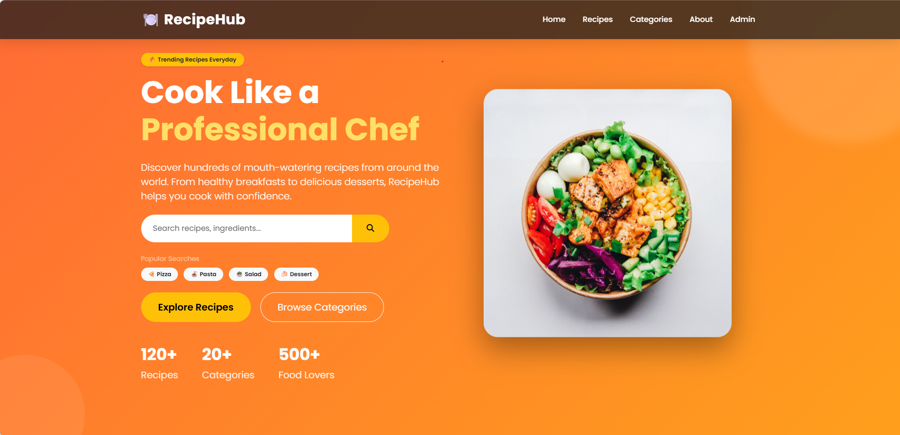
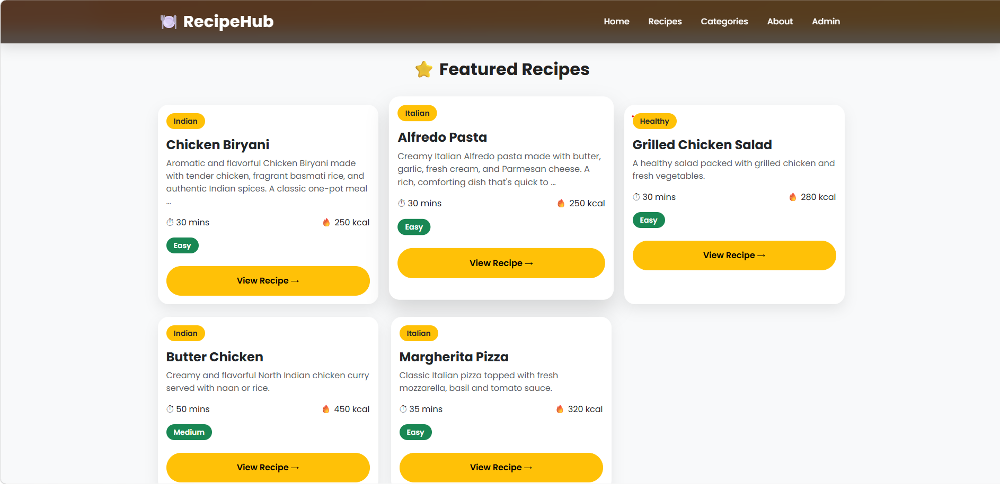
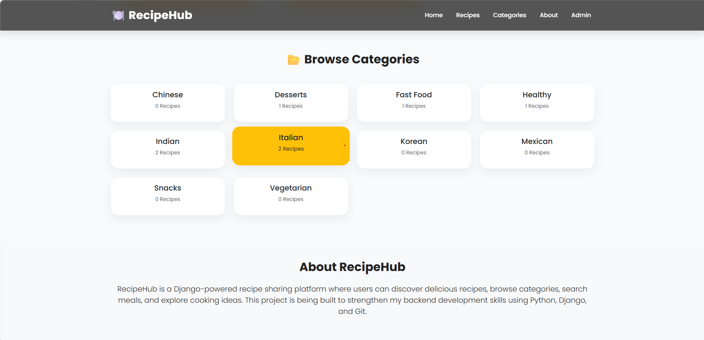
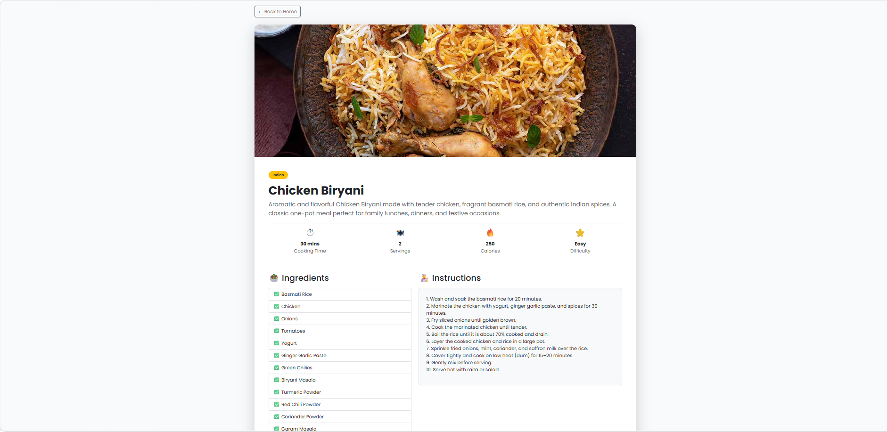

# 🍽️ RecipeHub

RecipeHub is a recipe management web application built using **Python** and **Django**. It allows users to explore recipes, browse categories, search for recipes, and view detailed cooking instructions through a clean and responsive interface.

---

## 📸 Screenshots

### 🏠 Homepage



---

### 🍽️ Homepage - Featured Recipes



---

### 📂 Homepage - Categories



---

### 🍽️ All Recipes


---

### 📖 Recipe Detail



---

## ✨ Features

- Dynamic Homepage
- Featured Recipes
- Browse Recipes by Category
- Recipe Detail Page
- Category Detail Page
- Search Recipes
- Pagination
- Category Filter
- Difficulty Filter
- Responsive Design
- Django Admin Integration

---

## 🛠 Tech Stack

- Python
- Django
- SQLite
- HTML5
- CSS3
- Bootstrap 5
- Git & GitHub

---

## 📂 Project Structure

```
recipehub/
│
├── recipehub/
├── recipes/
├── templates/
├── static/
├── media/
├── manage.py
└── README.md
```

---

## 🚀 Getting Started

### Clone the Repository

```bash
git clone https://github.com/rakshithaagowda/RecipeHub.git
```

### Navigate to the Project

```bash
cd RecipeHub
```

### Create Virtual Environment

```bash
python -m venv venv
```

### Activate Virtual Environment

Windows

```bash
venv\Scripts\activate
```

Mac/Linux

```bash
source venv/bin/activate
```

### Install Dependencies

```bash
pip install -r requirements.txt
```

### Run the Server

```bash
python manage.py runserver
```

---

## 📌 Future Enhancements

- User Authentication
- Favorites
- Comments & Ratings
- AI-powered Recipe Recommendations
- Recipe Image Uploads
- Deployment

---

## 👩‍💻 Author

**Rakshitha R S**

Computer Science Engineering Student

GitHub:
https://github.com/rakshithaagowda

---

⭐ If you like this project, feel free to star the repository!